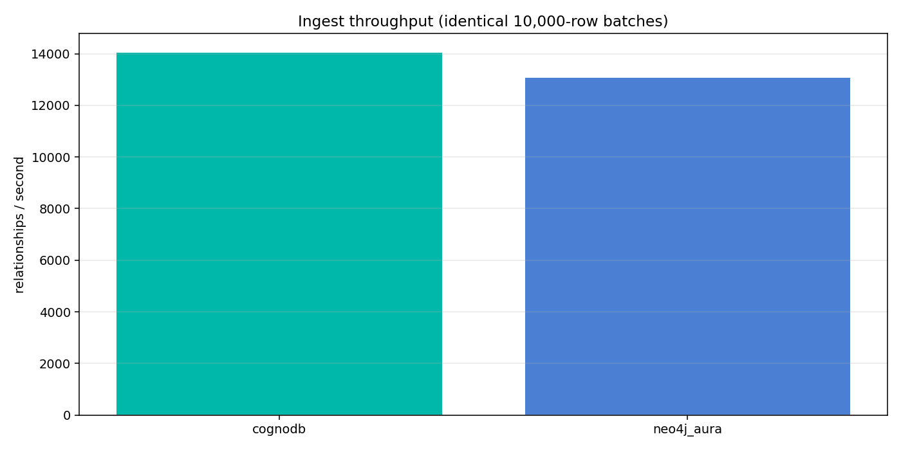
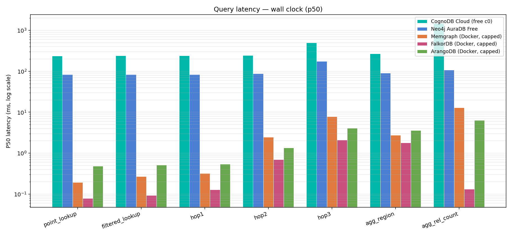
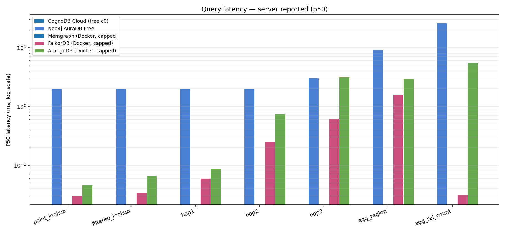
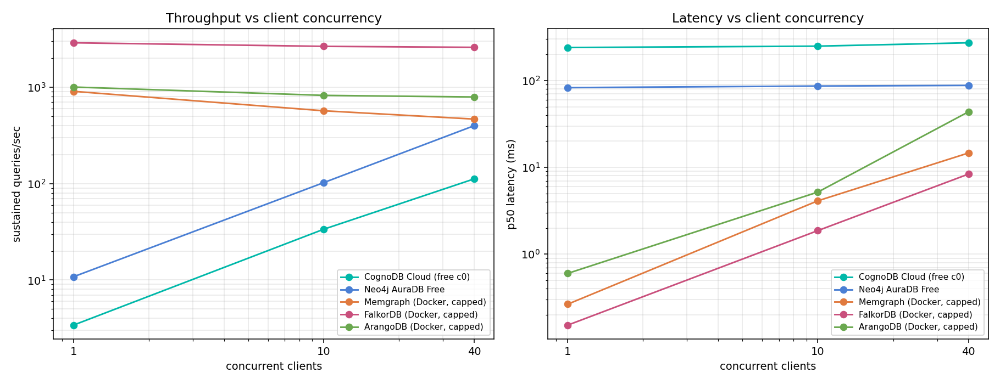

# Graph Database Cloud Benchmark

A reproducible comparison of **CognoDB Cloud**, **Neo4j AuraDB Free**, **Memgraph**, **FalkorDB** and **ArangoDB** on an identical 150,000-relationship graph under identical resource limits.

**The headline is not which database won.** It is that the first version of this benchmark measured the Indian Ocean, and the second version found a bug that silently discarded 150,000 records.

📝 **Full write-up:** [I benchmarked 5 graph databases. The first four hours measured the Indian Ocean.](https://dev.to/burz4m_13b009bb9f0a92a88c/i-benchmarked-5-graph-databases-the-first-four-hours-measured-the-indian-ocean-1ea0)

---

## TL;DR

| | Finding |
|---|---|
| ⚠️ | **CognoDB `v0.9.11` silently loses writes for ~29s after index creation.** Index population is asynchronous with no queryable readiness signal. During that window an indexed lookup returns *empty* rather than erroring — so `MATCH ... CREATE` succeeds and creates nothing. Our first run reported 23,211 rel/s for 150,000 relationships that never existed. |
| 🌍 | **Raw latency is 99% geography.** CognoDB (Virginia) 243.7 ms RTT, Aura (Singapore) 87.6 ms, local containers 0.06 ms. A naive table says FalkorDB is 2,700× faster at point lookups. It isn't. |
| 📡 | **Large result sets cost an extra full round trip.** At 748 rows both managed platforms jump by exactly one RTT — Bolt paginates. RTT-adjustment *undercorrects* above ~700 rows. |
| 🔀 | **Concurrency scaling inverts by deployment type.** Managed platforms scaled 33–37× from 1→40 clients. Local platforms went *backwards*. |
| 🛡️ | **Two backpressure philosophies.** At 40 clients FalkorDB shed 1.56% of load and held p50 at 8.4 ms; ArangoDB accepted everything and let p50 climb to 43.6 ms. |

---

## Platforms

| Platform | Deployment | Engine | Query language | Version |
|---|---|---|---|---|
| CognoDB Cloud | Managed, GCP `us-east4` | Bolt-compatible graph service | Cypher | v0.9.11 |
| Neo4j AuraDB Free | Managed, GCP `asia-southeast1` | Native property graph (JVM) | Cypher | Neo4j Kernel 5.27-aura |
| Memgraph | Docker, capped | In-memory C++ | Cypher | 2.18.1 |
| FalkorDB | Docker, capped | Redis module, sparse matrices + GraphBLAS | Cypher (subset) | v4.2.2 |
| ArangoDB | Docker, capped | Multi-model, RocksDB | AQL | 3.11.10 |

**Why these five.** Two managed services give a genuine cloud-to-cloud comparison; three self-hosted engines give architectural spread — in-memory, linear-algebra, and disk-backed multi-model. ArangoDB is included specifically because it has *no Cypher*: if the harness only worked on Cypher engines, it would be benchmarking a query language rather than databases.

**A sixth platform failed.** Neo4j Community 5.26 is included in `docker-compose.yml` under the `expected-failure` profile. The JVM cannot initialise heap plus page cache inside the 512 MB envelope. Reported rather than omitted.

---

## Fairness: same resources everywhere

| Platform | vCPU | RAM | Disk | How enforced |
|---|---|---|---|---|
| CognoDB | burst to 0.5 | 512 MB | 1 GiB | Vendor free tier (`c0`) |
| Neo4j Aura Free | not disclosed | ~250 MB (unverified) | quota-based | Vendor free tier |
| Memgraph | 0.5 | 512 MB | 1 GiB | `cpus: 0.5`, `mem_limit: 512m`, cgroups v2 |
| FalkorDB | 0.5 | 512 MB | 1 GiB | same |
| ArangoDB | 0.5 | 512 MB | 1 GiB | same |

**The brief says 256 MB; the provisioned instance says 512 MB.** The CognoDB console reports 512 MB in three places for instance `db-230f88c8` (`c0`, `us-east4`). We sized every platform to the *observed* spec and document the divergence rather than silently picking one.

**Aura Free publishes no vCPU/RAM figures.** This is a genuine hole in tier parity that cannot be closed from outside — Aura Free is quota-based (node/relationship caps) rather than resource-based, and does not permit configuration. Flagged, not hidden.

Container isolation: all three self-hosted services were pinned via `cpuset: "4,6"` — two distinct physical P-cores on the 12700K (verified with `lscpu -e`; cores 4 and 5 are hyperthreads of the *same* core and would have contended). The benchmark host runs 13 unrelated long-lived containers; pinning isolates the measured services from that background load.

---

## Dataset

**SNAP soc-Pokec social network**, deterministically sampled.

| | |
|---|---|
| Source | https://snap.stanford.edu/data/soc-Pokec.html |
| Full graph | 1,632,803 nodes / 30,622,564 directed edges |
| Sample | **13,180 nodes / 150,000 relationships** |
| Avg out-degree | 11.38 |
| Method | BFS/snowball from a deterministically chosen high-degree seed (node 11123) |
| Seed | `SAMPLE_SEED=20260820` |
| Node properties | `uid` (int), `gender` (str), `region` (str), `age` (int) |
| Relationship type | `FRIEND` (directed) |
| Verification | SHA-256 of both CSVs recorded in `data/manifest.json` |

**Why BFS and not random-edge sampling.** Drawing 150,000 edges uniformly at random from 30.6M yields average degree ≈ 1: multi-hop traversals terminate immediately and the traversal benchmark measures nothing. A BFS ball preserves local density and degree skew, so traversal costs are representative.

**Why 150,000 and not more.** Neo4j's own documentation contradicts itself on the Aura Free cap — the product announcement states 50k nodes / 175k relationships, the FAQ states 200k / 400k. We sized to the conservative figure so the *identical* dataset loads everywhere. A dataset that fits four platforms and not the fifth is not a benchmark.

**Node properties are real, not synthetic.** Pokec ships profile attributes, which is why `region` and `age` support genuine indexed lookups and a genuine group-by rather than fabricated fields.

---

## Methodology

### Same logical query everywhere — verified, not assumed

All three Bolt platforms share byte-identical query strings. ArangoDB requires translation to AQL, and translations are where benchmarks quietly cheat. Two translations mattered:

1. **`RETURN DISTINCT x LIMIT n` has no single-clause AQL equivalent.** Writing `LIMIT n ... RETURN DISTINCT x` limits *before* deduplicating, producing a smaller and cheaper query. We materialise the distinct set in a subquery and limit afterwards.
2. **Traversal uniqueness semantics differ.** Cypher enforces relationship-isomorphism within a path; AQL's behaviour depends on `uniqueEdges`/`uniqueVertices` options that default differently. These are stated explicitly rather than defaulted.

`verify_semantics()` runs every workload on every platform with identical parameters and compares row counts. **All seven workloads agreed exactly** — 1, 9, 15, 375, 748, 20, 1 rows across two query languages and three engines. Equivalence is demonstrated, not claimed.

### Workloads

| Workload | Category | What it does |
|---|---|---|
| `point_lookup` | Lookups | Fetch one User by indexed `uid` |
| `filtered_lookup` | Lookups | Users by indexed `region` + `age >=` range predicate |
| `hop1` / `hop2` / `hop3` | Traversals | Distinct uids at exactly 1/2/3 outbound FRIEND hops |
| `agg_region` | Aggregations | Group all Users by `region`, count, top 20 |
| `agg_rel_count` | Aggregations | Total FRIEND relationship count |
| `write_edge` | Mixed | Idempotent `MERGE` of one edge (concurrency sweep only) |

**Measurement:** 30 warm-up iterations discarded, then **120 measured iterations** per workload per platform. Percentiles use nearest-rank on the sorted sample, so a reported p95 is an observation that actually happened rather than an interpolated value.

**Parameters are identical across platforms.** A seeded RNG generates the same start-node sequence for every engine, so nobody gets easier work. Start nodes are drawn only from nodes with outbound edges — sampling uniformly from all nodes would select mostly leaves and make multi-hop traversals trivially cheap.

**Traversal `LIMIT`** was set to 1,000 as a guard against CognoDB's hard 50,000-row server-side cap. Observed maximum cardinality was 748, so **the limit never bound** — these are full expansions, not truncated prefixes.

### Indexes

| Platform | Indexes created |
|---|---|
| CognoDB | range on `uid`, range on `region`, composite on `(region, age)` |
| Neo4j Aura | range on `uid`, range on `region`, composite on `(region, age)` |
| ArangoDB | primary on `_key`, persistent on `region`, persistent on `(region, age)` |
| Memgraph | label-property on `uid`, on `region` — **no composite support in 2.18** |
| FalkorDB | range on `uid`, on `region` — **composite silently not materialised** |

FalkorDB accepts a composite `CREATE INDEX` statement without error but registers the properties individually; `CALL db.indexes()` confirms only `uid` and `region`. The harness reads the index set back after creation rather than trusting the statement. **Consequence:** two platforms evaluate `age >= n` against an index, two evaluate it post-scan. This is a capability difference, reported rather than equalised by crippling the others.

### The geography problem

The single largest methodological issue in this benchmark. Measured baseline RTT (p50 of 50 × `RETURN 1`, after connection warm-up):

| Platform | RTT p50 | RTT p95 | Location |
|---|---|---|---|
| CognoDB | 243.66 ms | 258.36 ms | GCP `us-east4` (N. Virginia) |
| Neo4j Aura | 87.56 ms | 200.44 ms | GCP `asia-southeast1` (Singapore) |
| Memgraph | 0.18 ms | 0.42 ms | localhost |
| FalkorDB | 0.06 ms | 0.10 ms | localhost |
| ArangoDB | 0.43 ms | 0.47 ms | localhost |

Client is in Telangana, India. Neither free tier permits choosing a region, so this cannot be eliminated — only measured and corrected for.

Aura's region was determined empirically: `dig` resolves `04fc136a.databases.neo4j.io` → `34.126.64.110`, inside Google Cloud's published `34.126.64.0/18` block, scope `asia-southeast1`. The ~15,000 km separation from `us-east4` predicts the measured 156 ms gap.

**Three views of every latency are therefore reported:**

1. **Raw wall-clock** — what a user in India actually experiences
2. **RTT-adjusted** — wall-clock minus that platform's ping baseline
3. **Server-reported** — measured inside the engine, network excluded

Server-side timing is available on Aura, FalkorDB and ArangoDB. **CognoDB and Memgraph do not report it.** On Aura, where both exist, RTT-adjustment and server-reported timing agree within single-digit milliseconds for small result sets — which is what licenses using RTT-adjustment on the two platforms that don't report.

Also note Aura's RTT p95 of 200 ms against an 87.6 ms p50 — a 113 ms tail on `RETURN 1`, versus CognoDB's 15 ms spread. Aura Free appears to run on shared throttled infrastructure; CognoDB's free tier is further away but far more consistent.

---

## Results

### Ingest throughput

Identical 10,000-row batches over driver-level `UNWIND`/`insert_many` on every platform.

| Platform | Nodes/s | **Rels/s** | Index build | Index ready | Total wall-clock |
|---|---|---|---|---|---|
| Memgraph | 77,574 | **132,608** | 3.0 s | — | 4.3 s |
| FalkorDB | 32,213 | 59,501 | 0.1 s | — | 3.0 s |
| ArangoDB | 38,440 | 58,021 | 0.0 s | — | **2.9 s** |
| CognoDB | 5,259 | 14,076 | 4.2 s | **28.8 s** | 17.4 s |
| Neo4j Aura | 8,906 | 12,914 | 0.4 s | — | 13.5 s |



**Round-trip tax.** Batch size is identical everywhere, which is fair but costly for remote platforms: 15 edge batches × RTT is pure network. CognoDB pays ~3.6 s of its 10.7 s; Aura pays ~1.3 s of 11.6 s. Net of that, CognoDB's engine-time ingest is ≈21,100 rel/s against Aura's ≈14,600 — roughly 45% faster despite being 2.8× further away.

**Memgraph trades index time for write time.** It writes edges 2.2× faster than anyone but spends 3.0 s building indexes, so ArangoDB wins wall-clock while losing throughput. Two metrics, two winners.

### Query latency — raw wall-clock (p50 / p95, ms)

| Workload | CognoDB | Neo4j Aura | Memgraph | FalkorDB | ArangoDB |
|---|---|---|---|---|---|
| point_lookup | 239.61 / 240.58 | 83.88 / 85.42 | 0.19 / 0.29 | **0.08 / 0.09** | 0.49 / 0.73 |
| filtered_lookup | 239.88 / 241.18 | 83.49 / 90.91 | 0.27 / 0.65 | **0.09 / 0.17** | 0.52 / 0.71 |
| hop1 | 240.17 / 241.24 | 83.53 / 84.63 | 0.32 / 0.79 | **0.13 / 0.23** | 0.54 / 0.80 |
| hop2 | 246.46 / 501.76 | 87.48 / 179.10 | 2.45 / 8.37 | **0.70 / 1.97** | 1.35 / 4.20 |
| hop3 | 500.23 / 520.01 | 175.78 / 182.03 | 7.85 / 8.95 | **2.10 / 2.63** | 4.10 / 46.67 |
| agg_region | 268.76 / 286.75 | 91.11 / 96.24 | 2.74 / 6.86 | **1.79 / 3.06** | 3.60 / 44.64 |
| agg_rel_count | 1478.88 / 1605.72 | 107.73 / 120.94 | 12.95 / 65.95 | **0.13 / 0.26** | 6.33 / 52.54 |



**This table is mostly a map of undersea cables.** Read the next two instead.

### Query latency — server-reported (p50, ms)

Measured inside the engine; network excluded entirely.

| Workload | CognoDB | Neo4j Aura | Memgraph | FalkorDB | ArangoDB |
|---|---|---|---|---|---|
| point_lookup | not reported | 2.00 | not reported | **0.03** | 0.05 |
| filtered_lookup | not reported | 2.00 | not reported | **0.03** | 0.07 |
| hop1 | not reported | 2.00 | not reported | **0.06** | 0.09 |
| hop2 | not reported | 2.00 | not reported | **0.25** | 0.74 |
| hop3 | not reported | 3.00 | not reported | **0.62** | 3.14 |
| agg_region | not reported | 9.00 | not reported | **1.59** | 2.93 |
| agg_rel_count | not reported | 26.00 | not reported | **0.03** | 5.50 |



**FalkorDB is 5× faster than ArangoDB on hop3** in engine time (0.62 ms vs 3.14 ms). Root cause is architectural: FalkorDB evaluates traversals as sparse matrix multiplication — a 3-hop expansion is three matrix operations over compact structures — while ArangoDB walks RocksDB edge indexes document by document.

**Aura's server times are integers.** 2.00, 2.00, 2.00, 3.00 ms — Bolt reports `result_available_after`/`result_consumed_after` in whole milliseconds, so sub-millisecond resolution is unavailable on any Bolt platform.

### The extra round trip

| Platform | hop3 wall p50 | RTT baseline | Server p50 | Unexplained |
|---|---|---|---|---|
| Neo4j Aura | 175.78 | 87.56 | 3.00 | **85.2 ms ≈ 1 RTT** |
| CognoDB | 500.23 | 243.66 | — | **256.6 ms ≈ 1 RTT** |

At 748 rows both managed platforms jump by almost exactly one additional round trip. Local platforms show no such discontinuity. Bolt paginates large result sets, so **RTT-adjustment undercorrects above roughly 700 rows** — the correction there should be 2× RTT, not 1×. This was discovered by cross-checking the two views against each other and would have been invisible with either alone.

### Concurrency (15 s sustained, 90/10 read/write mix)

| Platform | 1 client | 10 clients | 40 clients | Scaling | p50 at 40 |
|---|---|---|---|---|---|
| CognoDB | 3.4 qps | 33.6 | **112.1** | 33× | 272.77 ms |
| Neo4j Aura | 10.8 qps | 102.4 | **399.7** | 37× | 87.98 ms |
| Memgraph | 908.9 qps | 571.1 | 468.3 | **0.52×** | 14.64 ms |
| FalkorDB | **2,900.9 qps** | 2,664.5 | 2,602.3 | 0.90× | 8.36 ms |
| ArangoDB | 1,007.5 qps | 825.3 | 794.0 | 0.79× | 43.63 ms |



**The direction reverses by deployment type, and the reason is structural.** Managed platforms are *latency-bound*: each client spends 88–244 ms waiting on the network, so additional clients fill dead time and throughput scales near-linearly. Local platforms are *CPU-bound* at 0.5 vCPU: already saturated at one client, so additional clients add pure queueing. Memgraph's p50 degrades 54× from 0.27 ms to 14.64 ms while throughput *falls*.

This means the single-client latency table and the concurrency table answer different questions, and neither alone tells you what to deploy.

**Backpressure.** FalkorDB rejected 619 of ~39,700 operations at 40 clients (1.56%) with `Max pending queries exceeded` — bounded admission control, holding p50 at 8.36 ms. ArangoDB accepted every request and let p50 climb to 43.63 ms. Neither is wrong; they are different contracts, and only a concurrency sweep reveals which one you're buying.

### Footprint

| Platform | Observable | Value |
|---|---|---|
| FalkorDB | ✅ | `INFO MEMORY` → `used_memory` |
| ArangoDB | ✅ | `figures()` → `documentsSize` per collection |
| CognoDB | Partial | Console reports stored size; not exposed over Bolt |
| Neo4j Aura | Partial | Console reports node/relationship quota %; store size not exposed |
| Memgraph | ❌ | Not exposed over Bolt; container RSS only via `docker stats` |

Exact values in `results/raw/ingest.json` under each platform's `footprint` key.

---

## Findings

### 1. CognoDB `v0.9.11` silently discards writes during index population

**Severity: data loss with no error signal.**

Index population is asynchronous. `CALL db.awaitIndexes()` is unsupported (`CypherSyntaxError`), and `SHOW INDEXES` returns `state: null`, `populationPercent: null` — so readiness cannot be queried. During the population window, an indexed lookup returns **zero rows instead of erroring or falling back to a label scan**. Any write guarded by such a lookup therefore succeeds while creating nothing: `relationships_created = 0`, no error, no warning.

Measured population time: **28.8 s** for 13,180 nodes across three indexes.

Isolated reproduction failed repeatedly — batch sizes from 10 to 10,000 all succeeded, as did writes immediately after index drop and after index creation, in both comma-`MATCH` and two-`MATCH` forms. The failure appeared only in the full automated sequence (reset → node load → index build → edge load), where the edge phase begins inside the population window.

**Our first run reported an ingest throughput of 23,211 rel/s for 150,000 relationships that did not exist.** It was caught only because the harness verifies server-reported counters instead of counting submitted rows. Reported to `cognodb@wexa.ai`.

Mitigation in this harness: `_await_index_ready()` polls an indexed lookup for a known uid until it resolves, and records the wait separately so it never inflates or deflates a throughput figure.

### 2. Never count the rows you submitted

The general lesson. A Cypher `CREATE` guarded by a `MATCH` that finds nothing *succeeds* and creates nothing. Any loader that computes throughput from `len(batch)` will publish a confident number for work that never happened. Only server-reported counters are trustworthy, and the load should be re-read in a fresh session afterwards — "acknowledged but not visible" is a different failure from "never happened."

### 3. Cypher compatibility is shallower than it looks

Three engines accept Cypher over Bolt and the same driver. None accept the same DDL.

- **Memgraph** rejects Neo4j's `CREATE INDEX name FOR (n:L) ON (n.p)` grammar; it requires `CREATE INDEX ON :L(p)`. It has no composite index support in 2.18.
- **FalkorDB** accepts a composite `CREATE INDEX` without error and doesn't build one.
- **CognoDB** doesn't implement `dbms.components()` or `db.awaitIndexes()`, and returned 0 for anonymous-pattern counts like `MATCH ()-[r]->()` where the label-qualified form worked.
- **ArangoDB** rejects bind parameters a query doesn't reference; Cypher silently ignores them.

The measured *queries* are portable. Everything around them is not.

---

## Caveats

Honest list of everything still imperfect:

1. **Region parity is impossible on free tiers.** CognoDB is in Virginia, Aura in Singapore, and neither permits choosing. This is the largest single confound and is corrected for, not eliminated.
2. **Aura Free publishes no vCPU/RAM.** Resource parity with Aura is asserted by tier, not verified by spec.
3. **CognoDB and Memgraph don't report server-side execution time**, so their engine-cost figures rest on RTT subtraction, validated indirectly via Aura.
4. **Bolt reports server time in whole milliseconds**, so sub-millisecond engine costs are unresolvable on Bolt platforms.
5. **TLS asymmetry.** Managed platforms are accessed over TLS (as their services require); local containers over plaintext localhost. Included in wall-clock for the managed pair, absent for the local three.
6. **Index capability differs.** Two platforms have a composite `(region, age)` index; two do not. `filtered_lookup` is not measuring identical index structures.
7. **Local platforms shared a host with 13 unrelated containers.** Mitigated by `cpuset` pinning; not eliminated.
8. **Single measurement run.** Variance across repeated full runs was not characterised — a real gap given ArangoDB's p95 tails (46.67 ms against a 4.10 ms p50, likely RocksDB compaction).
9. **CognoDB's ingest figure includes a 28.8 s index-readiness wait** that no other platform required. It is excluded from the throughput calculation but inflates total wall-clock.
10. **One dataset, one shape.** A 13,180-node BFS ball with average degree 11.4 is not representative of all graph workloads.

---

## Reproduce it

Requires Docker, Python 3.11+, and free-tier accounts on CognoDB and Neo4j Aura.

```bash
git clone https://github.com/FANZ3R/graph-database-cloud-benchmark.git
cd graph-database-cloud-benchmark

python3 -m venv .venv && source .venv/bin/activate
pip install -r requirements.txt

cp .env.example .env
# Fill in COGNODB_URI / COGNODB_PASSWORD and NEO4J_AURA_URI / NEO4J_AURA_PASSWORD

docker compose -f docker/docker-compose.yml up -d
docker stats --no-stream          # verify the 512 MB caps are real

python -m bench.smoke             # connectivity + RTT baselines
python -m bench.dataset           # ~330 MB download, builds the sample
python -m bench.loader            # loads all five platforms
python -m bench.runner            # all workloads + concurrency sweep
python -m bench.charts            # regenerates every chart
```

Individual platforms: `python -m bench.loader falkordb`, `python -m bench.runner cognodb`.

The dataset build is deterministic — `data/manifest.json` records SHA-256 hashes of both CSVs, so a rebuild on any machine produces a byte-identical graph.

**No credentials are stored in this repository.** Everything is read from environment variables via `.env`, which is gitignored.

---

## Environment

| | |
|---|---|
| Client | Ubuntu 22.04.5, Linux 6.8.0-101 |
| CPU | Intel i7-12700K (8 P-cores + 4 E-cores, 20 threads) |
| Python | 3.13 |
| Docker | Native engine (not Docker Desktop), cgroups v2 |
| Location | Telangana, India |
| Client fingerprint | `e7a882e7ca9a5b70` |

Every result file records an environment fingerprint. The harness refuses to merge results from different fingerprints, because the assignment requires all platforms to be measured from the same client machine.

---

## Repository layout

```
bench/
  config.py        platform registry, resource specs, env loading
  dataset.py       SNAP download, deterministic BFS sample, CSV emit
  workloads.py     workload catalogue + deterministic parameter sampler
  loader.py        ingest measurement, index readiness polling
  runner.py        warm-up, percentiles, semantic verification, sweep
  stats.py         nearest-rank percentiles
  charts.py        matplotlib output
  smoke.py         connectivity + RTT baseline
  envinfo.py       environment fingerprint
  adapters/
    base.py        abstract interface
    bolt.py        CognoDB, Neo4j Aura, Memgraph
    falkor.py      FalkorDB
    arango.py      ArangoDB (AQL translation)
docker/
  docker-compose.yml   capped services + expected-failure Neo4j Community
results/
  raw/             ingest.json, workloads.json, rtt_baseline.json, run.log
  charts/          generated PNGs
```
